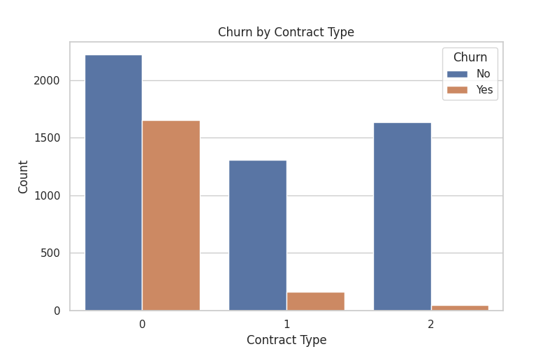
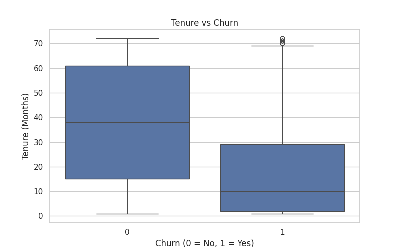
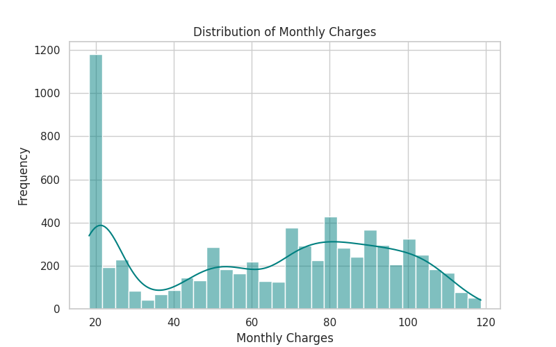

# 📊 Customer Churn Analysis

## 🔍 Project Objective
Analyze customer behavior to identify factors leading to churn using the Telco Customer Churn dataset. Build a model to predict which customers are likely to churn.

---

## 🛠️ Skills Applied
- Python (Pandas, NumPy, Matplotlib, Seaborn)
- Scikit-learn (Logistic Regression, Decision Tree)
- Data Cleaning and EDA
- Classification Metrics
- Git and GitHub

---

## 📁 Dataset
- **Source**: [Kaggle - Telco Customer Churn](https://www.kaggle.com/datasets/blastchar/telco-customer-churn)
- **File Used**: `WA_Fn-UseC_-Telco-Customer-Churn.csv`

---

## 📌 Key Steps

1. **Data Cleaning**: Handled missing values, converted types.
2. **Exploratory Data Analysis (EDA)**:
   - Contract types, tenure, charges, churn patterns.
3. **Feature Encoding**: Used LabelEncoder for categorical data.
4. **Modeling**:
   - Logistic Regression (Accuracy: ~80%)
   - Decision Tree Classifier (Accuracy: ~78%)
5. **Evaluation**:
   - Classification Report & Confusion Matrix

---

## 📈 Key Insights

- 📉 Month-to-month contracts had significantly higher churn.
- 💰 Customers with higher monthly charges were more likely to churn.
- 🕒 Low-tenure customers (new users) showed higher churn risk.
- 🛡️ Lack of services like tech support or online security increased churn likelihood.

---

## 📷 Visualizations

### 🔸 Churn by Contract Type

### 🔸 Tenure vs Churn

### 🔸 Distribution of Monthly Charges

---

## 💾 Files Included

- `customer_churn_analysis.ipynb` – Jupyter Notebook with full code
- `WA_Fn-UseC_-Telco-Customer-Churn.csv` – Dataset
- `*.png` – Visualizations
- *(Optional)* Power BI dashboard: `churn_dashboard.pbix`

---

## ✅ Project Status
📌 Completed — EDA and ML models are implemented and evaluated.

---

## 🚀 Next Steps
- Power BI dashboard integration *(optional)*
- Hyperparameter tuning for better accuracy
- Deploy model in Streamlit or Flask

---

## 🔗 GitHub Link
[🔗 View This Project on GitHub](https://github.com/d-s-priya/data-analyst-portfolio/tree/main/customer-churn-analysis)
